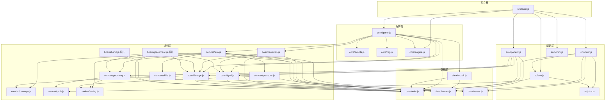

# 架构（Round 3 回签版）

> 审计基线：commit `ade1d0a`（代码至 `9e152b4`；Round 2 十路工作 `998fdba..a7cc5bb` 已全部合入父分支，Round 3 的课程计数修复 `2364b9e`、孤儿对拍 `0c1afb4`、读档加固 `9e152b4` 等也已落地）。本版把 Round 2 落地的 **回放快照、每侧敌人号段、覆盖打分 AI、juice 演出、决胜段数值、课程计数修复、读档 NaN 卫生** 从「在途」回签为**已实现**，并重列仍缺项。
> 标记约定：**【已实现】** 与合入代码逐行核对（无标记即已实现）；**【缺口】** 当前代码不存在，排期见 §10 与契约 §10。
> Round 3 冲刺清单见 `/.agent_workspace/round2/BRIEF.md`。

## 1. 技术栈与硬约束

- Vite 6 + 原生 ES Module，零运行时依赖，无框架、无后端、无打包别名。
- 单页挂载点 `index.html` 的 `<div id="app">`；`src/main.js` 是唯一组合根（composition root）。
- 开发/预览端口 **4180**（`strictPort: true`），`base: './'`，产物可 file:// 直开。
- 测试 Vitest（node 环境）；根 `vite.config.js` 的 `test.include` 同时收 `tests/**/*.test.js` 与 `src/**/*.test.js`，全量 18 文件一条 `npm test` 跑完（`src/combat/vitest.config.js` 是并行开发期遗留，可跑但非必需）。
- 基准 `scripts/bench.mjs`（36 局，**内置胜率闸门 0.40–0.60**）、冒烟 `scripts/probe.mjs`、共享不变量 `scripts/invariants.mjs`、对局遥测 `scripts/metrics.mjs`（probe/bench 共用）。
- 字体双保险：`index.html` 仍引 Google Fonts CDN（`Ma Shan Zheng` / `Noto Serif SC`，`display=swap`），但 `tokens.css` 的 `--font-body/--font-brush` 已带完整系统字栈（宋体系 / 楷体系）——离线、内网、微信内直开会**平滑回退**而非破相。自托管 woff2 仍未做（§10 R6）。

## 2. 模块图（与实际 import 逐一核对）



### 分层规则（import 白名单）

| 层 | 目录 | 允许 import | 禁止 |
| --- | --- | --- | --- |
| 数据 | `data/*` | 仅同层（`recruit→units,heroes`） | 一切上层 |
| 规则 | `board/*` `combat/*` | `data/*`、同层 | `core/game`、`ui`、`ai`、DOM |
| 编排 | `core/*` | `data/*`、规则层 | `ui`、`ai`、DOM、`window` |
| 驱动 | `ai/*` `ui/*` `audio/*` | 规则层谓词、`data/*`；`ai` 只经 `api` 动词改状态 | 直接改 `state`（残留违规：`side._acc`，§10 R4） |
| 组合根 | `main.js` | 一切 | — |

事实核查（相对 Round 2 审计的变化）：

- **`ui/juice.js` 是新驱动层模块**：`render.js` 每帧幂等调 `attachJuice(api)` 挂总线，`lane.js` 消费 `noteEnemies/takeLaneEffects/fxProgress` 画泼墨。它不 import 任何 src 模块，自挂 `#zy-juice` 图层在 `document.body`（躲开 morphChildren 的 diff）。
- **`combat/tuning.js` 是新调参基座**：`sim/geometry/pressure` 三处旋钮统一为「模块默认值 < data 表可选导出 < 运行时 `configureX`」三层；`resetX` 只丢运行时补丁、保留表覆盖。表侧覆盖键：`waves.BALANCE|COMBAT_BALANCE`、`waves.PRESSURE|PRESSURE_TUNING`、`units.REACH|REACH_TUNING|RANGE_TUNING`（当前表里都没写，走默认值）。
- **`ai/opponent.js` 已改用真实覆盖**（P/R5 已修）：布阵主项是 `seatValue`（`coverageWindows` 按 48 段路线加权求和，末段权重 ×4），`cellDistToPath` 在 AI 里已无引用；新增「阵型换座」动作（乘法门槛 `MOVE_GAIN=1.3` 防来回蹦）。
- `combat/path.js` 消费者仍是 `ui/lane.js` 与 `combat/geometry.js`；`nearestPathT` 仍无运行时调用方。
- 孤儿现状（0c1afb4 已用 **对拍测试 + 接入清单** 钉住语义，但仍零运行时消费者）：`board/hand.js` 全模块（`hand.test.js` 16 例，文件头列出 game.js 三处 push/splice 的等价替换）；`merge.classifyDrop/canSwap`（`drop.test.js` 39 例与 game 的 place/merge 逐分支对拍，`classifyDrop` 增 `{from:"hand"}` 选项）；`board/placement.js` 全模块（21 例，AI 未接它——opponent 自带 seatValue）；`awaken.atkBonus` 恒 0。
- 模块级可变单例（同进程跨 `createGame` 实例共享、均不入存档）：`sim.BALANCE`、`geometry.REACH`、`pressure.CONFIG`（均为 tuning.live，读写对 `configureX/xConfig/resetX` **只允许测试与调参脚本调用**）；`recruit.rollCounts`（WeakMap，已由 game 经 `resetRecruitRolls/setRecruitRolls` 托管，§7）；`opponent.boardMoveSupported` 与 `opponent.seatCache`；`render.stylesInjected`；`juice` 的 `laneFx/seen/floats/bound`（`detachJuice/resetJuice` 清场）。**`sim.enemySeq` 已不存在**——号段搬进了 side（§7）。

## 3. 运行时状态形状【已实现】

单一可变状态树，由 `createGame()` 闭包持有；默认快照形状锁在 `tests/state.test.js`：

```ts
GameState {
  phase: "menu" | "playing" | "paused" | "over";
  winner: null | "player" | "ai";
  tie: boolean; reason: "hearts" | "survived" | null;
                             // R2 起在 state 上预置（读档有稳定回填位）；
                             // 终局由 sim 写入；默认快照仍不含、回放档才带（§8）
  time: number;              // 累计模拟秒
  wave: number;              // 全局波次（双侧同步），MAX_WAVE = 13
  seed: number;
  rng: Rng;                  // 序列化时剥离
  sides: { player: Side, ai: Side };
  log: LogEntry[];           // 环形 ≤200 条，{t, type, payload}
}
Side {
  id; mantou (起始60); hearts (3，漏怪钳制到 0); recruitCount;
  cells: Cell[20]; hand: Card[≤5]; enemies: Enemy[]; spawnQueue: SpawnQueueEntry[];
  kills: number; haste: number;      // 仁德攻速剩余秒
  rally?: number;                    // 仁德增伤剩余秒（首次施放才出现）
  wave: number;                      // 与全局同步，漏怪补偿/压力波取材用
  leaks?: number;                    // 漏怪计数，平局裁定用
  pressureCharge?: number;           // 压力波充能（普通兵 +1 / 将 +3）
  pressure?: { wave, received, sent };  // 压力波台账（承压方按波清零）
  enemySeq?: number;                 // 【已实现·R2】敌人号段指针（首次出兵才写，
                                     //  两种快照都带走；缺字段按存活最大 id+1 续）
  _acc?: number;                     // stepAi 节流累加器：默认快照已剔除、
                                     //  回放档特意带走（§8）；仍挂状态树（§10 R4）
}
Cell  { index, col, row, unlocked, unit: Piece|null }
Enemy { id, t: 0..1, hp, maxHp, speed, reward, boss,
        skill: null|"haste"|"shield"|"split", stun, slowT, slowMul, shield,
        pressure: boolean,           // 压力援兵标记（其死亡不再充能，防对送循环）
        glyph: "兵"|"卒"|"将"|"援" }
```

棋子（`Piece`/`Card`）五种 `kind` 不变：`unit`（刀枪弓骑）、`glyph`（单字沉睡）、`hero`（觉醒武将）、`token`（神兵符，只在手牌）、`shovel`（铲子，只在手牌）。完整判别联合见 `API_CONTRACT.md` §2。

## 4. 帧管线与增量渲染【已实现】

`main.js` 用 `engine.createLoop`（rAF、dt 已 clamp ≤0.05s）驱动，每帧严格顺序：

1. `api.tick(dt)`：内部自钳 dt 并返回推进步数；`createGame({fixedStep})` 时切 `createStepper` 固定步长（默认 1/60、单帧最多 8 步、胜负分出即提前收敛），回放/联机更稳。默认逐帧推进。
2. tick 内部固定顺序：`time += dt` → `tickSideCombat(player)` → `tickSideCombat(ai)` → `checkWinner`（先 `linkArena` 登记对手）→ 仍在 `playing` 才 `maybeAdvanceWave`（双侧敌军+出兵队列全空才推波；≥13 波转 `finishByHearts`）。
3. `stepAi(api, dt)`：0.28s 节流，每次至多一个动作（配对挪字 > 板上合并 > 手牌动作 > 征兵 > 阵型换座，按分数取最大，§5）。
4. `drawLanes()`：每帧直画两条 canvas（DOM diff 会跳过 CANVAS，画布像素归 `drawLane` 独管）。`drawLane` 顺带做两件 juice 差事：`noteEnemies` 记本帧 id→路线进度（kill 事件只带 id，落墨点靠上一帧位置）、`takeLaneEffects` 取走存活特效画泼墨/技能演出。
5. UI 重排：30Hz 节流 + 脏标记 + **状态签名**（`signature()` 拼接 phase/资源/棋面/手牌/指针态，不变则整帧跳过 DOM 工作）。

**增量 DOM（P2 已修）**：`render()` 输出到离屏 `scratch` 容器，`morphChildren` 做同构 diff 回写真实 DOM——节点身份保持不变，拖拽/悬停/选中不再被 30Hz 重建打断。三条 diff 铁律：`style` 属性由运行时注入（拖拽 ghost、touch-action），diff 不删；`CANVAS` 整棵跳过；指针态 class（`drop/selected`）由 `decorate()` 在 diff 后补挂，渲染层不管理。

**juice 双通道（R2 落地）**：① DOM 飘字/墨晕/半区震颤挂在 `document.body` 下的 `#zy-juice` fixed 图层（WAAPI 自播自清，`FLOAT_CAP=12`），躲开 diff；② 画布特效入 `laneFx` 队列（`LANE_CAP=24/侧`），由 `drawLane` 每帧取走。`attachJuice(api)` 幂等（render 每帧调也不重复订阅）；`start/reset/load` 自动清场；`prefers-reduced-motion` 下飘字缩短、震颤取消。

输入层：PointerEvent 拖放（`DRAG_SLOP=6px` 区分点选/拖拽、ghost 跟手、`elementFromPoint` 定落点）+ 无 PointerEvent 浏览器的点选-点落兜底；键盘 空格/P 暂停、Esc 取消、Enter/E 征兵、R 重开、1–5 选牌；`visibilitychange` 自动暂停/恢复。调试入口 `window.__zhaoyun = { api, ui, save, restore }`（`save()` = 回放档、`restore(snap)` = 不写 log 的读档，存-读-存逐字节一致）；`?seed=` URL 参数定种子。

`tickSideCombat` 单侧顺序：haste/rally 衰减 → 出兵（间隔用减法防 dt 抖动，单帧追帧上限 8 只；小兵清完 0.6s 后出 Boss）→ 行军（`t += speed*dt/520`，眩晕冻结、减速取更狠的一档）→ 逐格攻击（§5）→ 死亡结算（赏金、split 分裂 2×卒、压力充能）→ 漏怪结算（心钳 0、`leaks+1`、补偿 `8+2w` 馒头）。

## 5. 真实射程、覆盖打分 AI 与压力波【已实现】

**真实射程（P1 已修）**：判定为 **格心 ↔ 敌人当前路线坐标的真实欧氏距离**（`combat/geometry.js`，棋盘与「几」字路线同坐标系、单位为格）。`reach = range*1.2 + 0.55`，外沿 `graze = reach*1.6` 内线性衰减到 0（软边缘）。热循环用 `falloffFor(range)` 预计算 + 平方距离先筛。索敌先打核心圈内的领头者，再按 `t` 降序。覆盖收窄以 `BALANCE.towerDamage = 1.35` 补偿（现可经 `waves.BALANCE` 表覆盖，data 归数值轮管）。

**覆盖消费者（R5 已修·Round 2 落地）**：`coverageWindows/coverageRatio` 现有两路运行时消费——`ai/opponent.js` 的 `seatValue`（记忆化座位价值表，末段权重线性抬升 ×4：同样罩一段路，罩在阿斗跟前的是最后一道拦截）与【孤儿】`board/placement.js`（UI 高亮/AI 选点通用打分，尚无人接）。AI 实测过「按已有 DPS 饱和度补空档」反而更差（每格各自索敌，稀缺的是开火时间不是覆盖），所以 seatValue 是**静态**价值表。

**统一伤害入口（P7 已修）**：普攻与全部大招都走 `combat/damage.applyDamage`（先破盾）；附带 `execute`（关羽斩杀线）、`applyStun/applySlow/knockback`。英雄大招冷却与是否有目标解耦（P8 已修），普攻/技能 CD 允许预支 `CD_BANK = 0.5s`。

**压力波（P13 已修）**：一侧每积 5 点斩获充能（普通兵 1、将 3）就向对岸 `spawnQueue` 塞一波弱化援兵（血 ×0.55、速 ×1.1、赏 ×0.5、字「援」、立即放出第一只）；承压方每波最多接 2 波；压力兵之死不再充能。对手发现走 `WeakMap`（`linkArena` 每帧幂等登记，不挂 `side.opponent` 防 serialize 循环引用；首帧击杀不产生压力，可忽略）。**压力充能与台账随快照迁移**——读档续跑攒到第 5 杀照常施压（`tests/round3-regressions.test.js` 锁定）。手动施压入口 `sendPressure(side, otherSide)` 留给道具/剧情。

**大招 juice 契约（R2 已修·Round 2 落地）**：`castSkill` 返回 `{id, name, fx, hits, damage, kills, targets, cooldown, juice:{shake, color, sfx, duration, focusT, shape, text, …}}` 随 `skill` 事件整包发出，`ui/juice.js` 照单演出：招式名楷书飘字 + 按 `shape`（sweep/rain/ring/arc/aura/dash）画泼墨 + 按 `shake` 震半区；`kill` 落墨（斩将重笔 + 金字「斩」）、`leak` 终点破阵圈、`merge` 墨晕 + Lv 飘字。**遗留双轨**：`styles/fx.css` 的契约类（`#fx-layer/.fx-float/.fx-splash/.fx-quake`）零 JS 消费者，juice.js 走自注入 `#zy-juice-css`——合流是 Round 3 冲刺第 1 项（§10 R2）。`pressure` 事件仍零订阅。

## 6. 事件目录【已实现】

`core/events.js` 同步总线：`on/once/onAny/off/clear`、派发时对监听列表做快照（回调内订阅/退订安全）、单监听器抛错被捕获打日志不中断循环。`game.js` 的 `emit` **先写 `state.log`（环形 200）后派发**。全部 19 种：

| type | payload | 发射点 | main.js 订阅 | juice.js 订阅 |
| --- | --- | --- | --- | --- |
| `start` | `{seed}` | game.start | 清选中+清提示 | 清场 |
| `reset` | `{seed}` | game.reset | — | 清场 |
| `pause` / `resume` | `{}` | game.pause/resume | 常驻提示 / 清提示 | — |
| `load` | `{seed, phase}` | game.load | 清选中+清提示+标脏 | 清场 |
| `recruit` | `{side, card, cost}` | game.recruit | sfx | — |
| `place` | `{side, cellIndex, unit ⚠活引用}` | game.place | — | — |
| `merge` | `{side, cellIndex, level}` | game.place(并入)/game.merge | sfx+toast | 墨晕+Lv 飘字+弹格 |
| `token` | `{side, cellIndex, level}` | game.place 与 game.merge 的符分支**均发** | — | — |
| `move` / `swap` | `{side, from, to}` | game.merge | — | — |
| `expand` | `{side, cellIndex}` | game.useShovel | toast | — |
| `hero-awaken` | `{side, names: string[]}` | game.tryAwaken | sfx+toast | — |
| `skill` | `{side, hero, skill, fx, hits, damage, kills, targets, cooldown, cellIndex, juice}` | sim→castSkill 后 | sfx+toast | 泼墨+招式名飘字+震屏 |
| `kill` | `{side, reward, boss, pressure, id}` | sim 死亡结算 | — | 墨溅+赏金/「斩」飘字 |
| `pressure` | `{from, to, count, wave, hp}` | sim←notePressureKill | — | —（⚠零订阅） |
| `leak` | `{side, hearts, boss}` | sim 漏怪结算 | sfx+震屏+toast | 破阵圈+「阿斗−1心」 |
| `wave` | `{wave}` | sim.maybeAdvanceWave | toast | — |
| `game-over` | `{winner, tie, reason}` | sim.checkWinner/finishByHearts | sfx+清选中 | — |

规则不变：**监听器只读，严禁在回调里改 state**（总线同步，回调在 tick 突变中途执行）；payload 可能持活引用（`place.unit`），`state.log` 里的 payload 在 `serialize()` 时才被深拷贝定格。事件 payload 的完整形状由 `tests/round3-regressions.test.js` 对 kill/leak/skill 三种做了逐键锁定。

## 7. 随机与确定性

- 唯一随机源 Mulberry32（`core/rng.js`），API 齐备：`next/int/range/pick/weighted/getState/setState/reseed/clone`。**禁止 `Math.random`**（grep 为零；连 lane 泼墨的抖动都用 `(id, i)` 散列 `hash01` 定数生成）。
- 消费点仍仅两处：`rollRecruit`（征兵抽卡，weighted+pick）。战斗、AI 决策完全无随机。
- `start()/restart()` 会 `rng.reseed(seed)` 回到序列起点：同种子重开的 rng 序列可复现。
- Round 2 审计的三个漂移源，**前两个已修**：
  1. ~~`sim.enemySeq` 模块级自增~~【已实现·R2】：号段搬进 `side.enemySeq`（首次出兵才写、被上限拒掉的出兵不烧号、两侧各数各的、快照往返续号、旧档缺字段按存活最大 id+1 兼容）。`src/combat/replay.test.js` 11 例锁定，含「同种子两跑快照逐字节一致」「读档续跑与原局逐帧一致」两条全局对拍。
  2. ~~课程计数器漂移~~【已实现·R3 `2364b9e`】：课程阶段判据改为 `recruitRolls()` = 双侧 `recruitCount` 之和（本来就在存档里，读档自动对齐、无需新字段）；`start/reset` 调 `resetRecruitRolls(rng)` 清 WeakMap、`load` 调 `setRecruitRolls` 对表。`rollRecruit(rng, rollIndex?)` 显式传序号时不动 WeakMap。`tests/round3-regressions.test.js` 锁定重开清零与读档续相两条。
  3. 玩家与 AI 共用一条 rng 流，AI 节流按真实 dt 累计，帧率差异改变双方抽卡交错；`fixedStep` 可消除帧率因素，per-side rng 拆分仍未做（§10 R11）。

## 8. 序列化与存档【已实现·Round 2 落地】

- `serialize(opts?)` 两种口味：
  - **默认**：字段白名单 `{phase, winner, time, wave, seed, sides, log}` 深拷贝（structuredClone，回落 JSON），sides 剔除内部键 `_acc`（`INTERNAL_SIDE_KEYS`），**保留 `enemySeq`**（战斗层存档字段）。JSON-safe、无函数、无 rng 对象（`tests/state.test.js` 锁形状）。
  - **回放档** `{replay: true}`（兼容旧名 `{rng: true}`）：额外带 `rngState` 游标、`tie/reason` 结算标记、`stepPending`（固定步长余量），且 sides **连 `_acc` 一起带走**——这份档才能逐帧续跑出同一局。`main.js` 的 `window.__zhaoyun.save()` 用的就是它。
- `load(snapshot, opts?)`：逐侧校验回填（缺侧补空侧、hand 截到上限、cells 长度不符则弃用）、`rng.reseed(seed)` + 可选 `setState(rngState)`、`setRecruitRolls` 对齐课程计数、stepper 复位 + 可选 `setPending`。事件开关：默认 emit `load`（写 log）；`{log: false}` 只派发总线不写 log（存-读-存逐字节一致）；`{silent: true}` 总线与 log 都不动。`tests/game-contract.test.js` 验证「JSON 存档 → 读档 → 随机续跑逐张一致」，`replay.test.js` 验证全局逐帧对拍。
- 暂停闭环：`pause/resume/setPaused/togglePause` + `get paused`，phase 含 `"paused"`；暂停期 `tick` 返回 0 且 stepper 清积累，恢复无时间跳变；标签页隐藏自动暂停。
- **读档 NaN 卫生【已实现·R3 `9e152b4`】**：`load()` 只保证 enemies/cells/spawnQueue 是数组，内容原样来自快照——战斗层现在整体容忍脏档：坏敌人/坏格子/缺 spec 的出兵条目被跳过或丢弃（战线不再永远「busy」）、非有限血量当已出局（NaN 不再成为打不死的钉子户）、非有限路线进度归 0、兵种 id 只认自有键、折线坏点在 `measurePath` 就剔除。`robustness.test.js` 24 例全部先红后绿验证。
- **仍缺项**：`SAVE_VERSION` 未导出（快照无版本字段，跨版本迁移无判据）；默认快照仍不含 `tie/reason`（UI 现未消费，影响低）。

## 9. 隔离规则

1. 本目录 `games/zhao-yun-adou/` 是独立游戏根：不 import 仓库根或其他 `games/*`；它们也不得写入此处（`OWNERSHIP.md`）。
2. 端口独占 4180；`strictPort` 保证冲突即失败而非漂移。
3. 一切资源相对路径（`base: './'`）；唯一外部网络依赖是 Google Fonts，且已具备系统字栈回退（§1、§10 R6）。
4. 规则层（`board/*`、`combat/*`）保持 DOM-free、window-free，node 直接单测——现状达标（render/lane/juice/sfx 里的 document/window 均在驱动层，juice 在无 DOM 环境自动降级为纯队列）。
5. 模块级调参单例（§2 末）只允许测试/调参脚本写；对局内平衡改动必须走 `data/*`（tuning 的表覆盖机制就是为此而设）。
6. `node_modules`、`dist` 目录内自治；根 `test.js` 与本游戏无关，禁改。

## 10. 已知风险与仍缺项（Round 3 视角）

Round 2 清单 R1–R13 处置结果：**已修** R1（胜率回拉）、R2 主体（juice 上屏）、R3（enemySeq + 课程计数）、R5（AI 接覆盖）。**部分修** R4/R6/R7/R9/R13。**未动** R8/R10/R11/R12。逐条如下：

| # | 严重度 | 位置 | 问题 | 处置 |
| --- | --- | --- | --- | --- |
| R1 | ~~高·平衡~~ | `data/waves.js` | ~~headless 胜率 91.7%~~ | 【已实现】血量斜率 12→18、决胜段 lateRamp 12/波、终章加码（`a7cc5bb`）；本轮实测 **0.4722**（17/36），且 bench 自身现在把 0.40–0.60 当过线闸门 |
| R2 | 高·演出 | `ui/juice.js`、`styles/fx.css` | ~~skill.juice/kill 无人消费~~ → 已上屏（`d140bd3`）。**遗留双轨**：fx.css 契约类零 JS 消费者，juice.js 自注入 `#zy-juice-css`；`pressure` 事件仍零订阅 | 【缺口】R3 冲刺第 1 项：juice.js 迁到 fx.css 契约类，顺带订阅 `pressure` |
| R3 | ~~中·确定性~~ | `sim.js`、`data/recruit.js` | ~~enemySeq 不复位；课程计数不重置/不恢复~~ | 【已实现】per-side 号段（`ddf99f8`）+ 课程计数随 start/load 对齐（`2364b9e`），replay/round3-regressions 测试锁定 |
| R4 | 低·分层 | `ai/opponent.js` | `side._acc` 节流器仍挂状态树；默认快照已剔除、回放档特意带走 | 【缺口】节流器移出状态树（严重度降：快照已不受污染） |
| R5 | ~~中·AI~~ | `ai/opponent.js` | ~~布阵按 cellDistToPath 老经验~~ | 【已实现】seatValue 直连 `coverageWindows`（`7d3429e`，opponent.test.js 8 例）；注意 AI 走自家 seatValue，`board/placement.js` 仍无运行时消费者（归 R9） |
| R6 | 低·隔离 | `index.html`、`tokens.css` | Google Fonts CDN 仍引；系统字栈已回退（离线不破相） | 【缺口·可选】自托管 woff2；Round 3 冲刺定调「不再依赖 Google Fonts 成败」已达成底线 |
| R7 | 低·存档 | `core/game.js` | `tie/reason/stepPending` 已入回放档；`SAVE_VERSION` 仍未导出、默认档不含 tie/reason | 【缺口】版本字段 |
| R8 | 低·语义 | `combat/skills.js` | `castSkill` 收 `ctx.reach` 但六个 handler 全部忽略——大招按「全路线」结算仍是事实设计 | 【缺口】语义定稿（删参或接入） |
| R9 | 低·卫生 | `board/*` | 孤儿：`hand.js` 全模块、`classifyDrop/canSwap`、`placement.js` 全模块、`nearestPathT`、`atkBonus`。`0c1afb4` 已补 55 例对拍测试 + 文件头接入清单（含两处已知不同调），语义不再会烂 | 【缺口】接入或删除（对拍已证明是等价替换） |
| R10 | 低·正确性 | `core/game.js` | `place.unit` 事件 payload 持活引用；`useShovel` 不查 `canShovel` 连通性（可经 api 开孤岛格，AI 自身不会） | 【缺口】 |
| R11 | 低·确定性 | `core/game.js` | 双方共用一条 rng 流（`rng.clone()` 已具备，未拆） | 【缺口】per-side 流 |
| R12 | 低·UX | `ui/render.js`、`main.js` | 教程仍是静态面板（`zy-tutor` 三步）+ 开局 coach 条；无强制引导、无首局记忆（src 内 `localStorage` 零引用）；aria/焦点管理缺失 | 【缺口】R3 冲刺第 3 项 |
| R13 | 低·测试 | `main.js`/`ui/*` | juice 层已有 13 例（node 环境，DOM 分支走降级路径）；morphChildren diff、拖拽手势、signature 跳帧仍零覆盖（jsdom 在 devDeps 未启用） | 【缺口】 |
| N1 | 低·文案 | `ui/render.js` | HUD 馒头悬浮说明写「10+4×已征次数」，实际 `recruitCost = 8+5n` | 【缺口】改文案 |
| N2 | ~~—·在途~~ | `combat/*` | ~~读档 NaN 卫生加固未提交~~ | 【已实现】`9e152b4` 落地、`ade1d0a` 24 例钉住（§8）；课程修复的死代码 `drawRecruitCard` 也已随 `7da2994` 删除 |

## 11. 性能基线（Round 3 回签时实测，node 22）

- `npm test`：18 文件 **218 用例全绿**，总时长 ~1.5s。
- `npm run probe`（seed 99）：八路径全通（recruit/place/merge/awaken/shovel/leak/gameOver/telemetry），遥测归因校验通过，不变量 0 违例，`passed: true`。
- `npm run bench`：36/36 收敛，玩家胜率 **0.4722**（17/36，落在 45–55% 目标窗口内，闸门 0.40–0.60）；平均单局模拟 30.9ms（≈4141 tick），p95 74.0ms，max 95.6ms，阈值 2000ms 余量巨大，0 不变量违例。对局时长分布 171–242s（p50 203s），落在 GDD 的 2.8–4.1 分钟目标带；觉醒均值 玩家 0.083 / AI 0.139（决胜段收紧后觉醒变稀，是否回调归数值轮判断）。
- 结论：逻辑层性能依旧不是瓶颈；渲染层签名不变整帧零 DOM 工作，变更帧只 morph 差异节点。juice 有硬上限（laneFx 24/侧、飘字 12）兜住清线爆发。「同屏 80+ 单位不掉 30fps」由 `MAX_ENEMIES = 120/侧` 与增量渲染共同兜底。

## 12. 测试与工具地图

| 入口 | 覆盖 | 用例数 |
| --- | --- | --- |
| `tests/merge.test.js` | 合并/神兵符谓词 | 3 |
| `tests/awaken.test.js` | 六武将双序觉醒、沉睡单字（`it.each`） | 7 |
| `tests/game.test.js` | 征兵费用曲线、满手/空格零副作用、铲/符、漏怪补偿、双归零裁定、落子 | 8 |
| `tests/state.test.js` | 序列化形状快照、同 seed AI 复现 | 2 |
| `tests/game-contract.test.js` | 暂停恢复不丢时间、板对板合并、报价=实扣、JSON 存档精确续跑 | 4 |
| `tests/round3-regressions.test.js` | kill/leak/skill payload 逐键锁定、压力充能跨档、课程计数重开/读档 | 5 |
| `src/ai/opponent.test.js` | seatValue 归一化/末段权重、布阵选覆盖格、残卷寄存、铲位、换座不来回蹦 | 8 |
| `src/board/placement.test.js` | 覆盖桥接、近战/远程分工、确定性、零突变、格子退化模式 | 21 |
| `src/board/hand.test.js` | 手牌谓词 + 与 game.js recruit/place 对拍（接入清单的证据） | 16 |
| `src/board/drop.test.js` | classifyDrop 具名用例矩阵 + 与 game.place/merge 逐分支对拍、`{from:"hand"}` | 39 |
| `src/combat/geometry.test.js` | 覆盖窗口/衰减/锚点/REACH 调参 | 6 |
| `src/combat/pressure.test.js` | 施压/封顶/充能/禁用/对手发现 | 11 |
| `src/combat/replay.test.js` | per-side 号段全套语义 + 同种子对拍 + 读档续跑对拍 | 11 |
| `src/combat/robustness.test.js` | 脏档卫生：null 敌人/格子、NaN 血量/进度、缺 spec 队列、原型链兵种 id、手工改坏的档能读能打 | 24 |
| `src/combat/sim.test.js` | 出兵/行军/索敌/衰减命中/波次/胜负链/BALANCE | 22 |
| `src/combat/skills.test.js` | 六式技能语义、护盾结算、juice 契约 | 8 |
| `src/combat/tuning.test.js` | 三层调参：表覆盖/类型过滤/收敛/复位 | 10 |
| `src/ui/juice.test.js` | 事件→特效接线、寿命/上限/清场/幂等 attach（node 环境注入时钟） | 13 |
| `scripts/probe.mjs` | 单局八路径冒烟 + 遥测归因 + 不变量（退出码即结论） | — |
| `scripts/bench.mjs` | 36 局收敛率/**胜率闸门 0.40–0.60**/漏怪分布/时长分布/耗时分布 | — |
| `scripts/metrics.mjs` | 对局遥测（逐波漏怪、觉醒计数、时长直方图），probe/bench 共用 | — |
| `scripts/invariants.mjs` | 心≤3、馒头≥0、手牌≤5、无 NaN/Infinity（probe/bench 共用） | — |

缺口：`main.js` 交互层（morphChildren/拖拽/签名）零测试（§10 R13）；`ui/render.js`、`ui/lane.js` 的 DOM/画布输出无断言。
