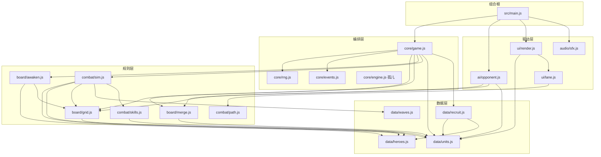

# 架构(Round 1 深度审计版)

> 审计基线:commit `04d65d3`。并行 Round-1 加固 agent 的**在途工作区改动**(未提交)覆盖 `core/{game,engine,events,rng}`、`board/{merge,grid,awaken,hand}`、`ai/opponent`、`main`:新增 load/存档、暂停、固定步长、拖放意图判定等,精确签名见 `API_CONTRACT.md` 各【在途·R1】小节。
> 标记约定:**【已实现】** 与基线代码逐行核对;**【在途·R1】** 工作区已实现、未提交;**【缺口·R2】** 下一轮计划,当前代码不存在。

## 1. 技术栈与硬约束

- Vite 6 + 原生 ES Module,零运行时依赖,无框架、无后端、无打包别名。
- 单页挂载点 `index.html` 的 `<div id="app">`;`src/main.js` 是唯一组合根(composition root)。
- 开发/预览端口 **4180**(`strictPort: true`),`base: './'`,产物可 file:// 直开。
- 测试 Vitest(node 环境,`tests/**/*.test.js`),基准 `scripts/bench.mjs`,冒烟 `scripts/probe.mjs`,共享不变量检查 `scripts/invariants.mjs`。
- 字体经 Google Fonts CDN 引入(`Ma Shan Zheng` / `Noto Serif SC`)——与 GDD「可离线」目标冲突,见 §9 风险 P3。

## 2. 模块图(与实际 import 逐一核对)



### 分层规则(import 白名单)

| 层 | 目录 | 允许 import | 禁止 |
| --- | --- | --- | --- |
| 数据 | `data/*` | 仅同层(`recruit→units,heroes`) | 一切上层 |
| 规则 | `board/*` `combat/*` | `data/*`、同层 | `core/game`、`ui`、`ai`、DOM |
| 编排 | `core/*` | `data/*`、规则层 | `ui`、`ai`、DOM、`window` |
| 驱动 | `ai/*` `ui/*` `audio/*` | 规则层谓词、`data/*`;`ai` 只经 `api` 动词改状态 | 直接改 `state`(现状违规,见 §9 P6) |
| 组合根 | `main.js` | 一切 | — |

事实核查:`combat/path.js` 仅被 `ui/lane.js` 消费(纯几何,战斗逻辑不用它);`core/engine.js` 的 `clampDt` **无人 import**,`main.js` 内联了同样的钳制(孤儿模块,§9 P12)。

## 3. 运行时状态形状【已实现】

单一可变状态树,由 `createGame()` 闭包持有;所有字段与 `tests/state.test.js` 内联快照一致:

```ts
GameState {
  phase: "menu" | "playing" | "over";   // 【在途·R1】新增 "paused"
  winner: null | "player" | "ai";
  time: number;            // 累计模拟秒
  wave: number;            // 全局波次(双侧同步)
  seed: number;            // 创建时种子
  rng: Rng;                // 序列化时剥离
  sides: { player: Side, ai: Side };
  log: LogEntry[];         // 环形 ≤200 条,{t,type,payload}
}
Side {
  id: "player"|"ai"; mantou: number; hearts: number; recruitCount: number;
  cells: Cell[20]; hand: Card[≤5]; enemies: Enemy[]; spawnQueue: SpawnQueueEntry[];
  kills: number; haste: number;    // 仁德剩余秒
  wave: number;                    // 与全局 wave 同步,漏怪补偿用
  _acc?: number;                   // ⚠ stepAi 私自挂上的节流累加器,会混入序列化(§9 P8)
}
Cell  { index, col, row, unlocked: boolean, unit: Piece|null }
Enemy { id, t: 0..1, hp, maxHp, speed, reward, boss, skill: null|"haste"|"shield"|"split",
        stun, shield, glyph }
```

棋子(`Piece`/`Card`)五种 `kind`:`unit`(刀枪弓骑,可合并)、`glyph`(武将单字,占格沉睡)、`hero`(觉醒武将,level 恒 5)、`token`(神兵符,只在手牌)、`shovel`(铲子,只在手牌)。完整判别联合见 `API_CONTRACT.md` §2。

## 4. 帧管线与 tick 顺序【已实现】

每个 `requestAnimationFrame`(`main.js`),严格顺序:

1. `dt = min(0.05, 实际帧差)` —— 钳制上限 50ms,后台标签页回来不会爆算。
2. `api.tick(dt)`,内部顺序**固定**:
   1. `state.time += dt`
   2. `tickSideCombat(player)` → 3. `tickSideCombat(ai)`(玩家侧先结算)
   4. `checkWinner`(心归零判负;双归零比 kills,平局判玩家胜)
   5. 仍在 `playing` 才 `maybeAdvanceWave`(双侧敌军+出兵队列全空才推波;≥12 波改为比心/比杀收局)
3. `stepAi(api, dt)` —— AI 在**同帧 tick 之后**行动,内部 0.28s 节流、每次至多一个动作(合并 > 铲 > 符 > 手牌合并 > 单字配对 > 落子 > 征兵)。
4. 30Hz 节流:`render(root, api, ui)` 全量重建 `#app` innerHTML + `bind()` 重挂监听。

`tickSideCombat` 单侧内部顺序:出兵队列(间隔小兵→清完 0.6s 后 Boss)→ 敌军行军(`e.t += speed*dt/520`,眩晕跳过)→ 逐格攻击(cd 递减→索敌→英雄技能/普攻→兵种普攻含穿透)→ 死亡结算(掉馒头、split Boss 分裂两只)→ 漏怪结算(扣心 + `8+2*wave` 馒头补偿)。

关键事实:**攻击是即时命中(hit-scan),不存在投射物**;索敌按 `t` 降序打最前;射程判定 `cellDistToPath(cell) <= reach+0.15` 是「格到棋盘边缘距离」门控,与敌人路径位置无关——且 5×4 网格边缘距离最大为 1,全兵种 reach≥1,**判定恒真,射程系统当前是摆设**(§9 P1)。

【在途·R1】管线变化:`tick(dt)` 内部自钳 dt 并返回推进步数,可选 `fixedStep` 走 `createStepper` 固定步长(默认 1/60、单帧最多 8 步);`main.js` 重写中,以上帧序描述以基线为准,提交后回签。

## 5. 事件目录【已实现】

`core/events.js` 同步总线;`core/game.js` 的 `emit` 包装同时写入 `state.log`(环形 200)。全部 12 种:

| type | payload | 发射点 | 现有订阅 |
| --- | --- | --- | --- |
| `start` | `{seed}` | game.start | — |
| `recruit` | `{side, card, cost}` | game.recruit | sfx |
| `place` | `{side, cellIndex, unit}` ⚠ unit 为活引用 | game.place | — |
| `merge` | `{side, cellIndex, level}` | game.place(手牌并入)/game.merge | sfx+toast |
| `token` | `{side, cellIndex}` | game.place(仅此路径;merge 的符分支**不发**) | — |
| `expand` | `{side, cellIndex}` | game.useShovel | — |
| `hero-awaken` | `{side, names: string[]}` | game.tryAwaken | sfx+toast |
| `skill` | `{side, hero, skill}`(中文名) | sim→castSkill 后 | sfx+toast |
| `kill` | `{side, reward, boss}` | sim 死亡结算 | — |
| `leak` | `{side, hearts}` | sim 漏怪结算 | sfx+震屏+toast |
| `wave` | `{wave}` | sim.maybeAdvanceWave | toast |
| `game-over` | `{winner}` | sim.checkWinner / finishByHearts | sfx |

规则:**监听器只读,严禁在回调里改 state**(总线是同步的,回调在 tick 突变中途执行);payload 可能持有活对象引用(`place.unit`),`state.log` 里的 payload 在 `serialize()` 时才被深拷贝定格——记录值是序列化时刻的,不是事件时刻的(§9 P9)。

【在途·R1】增补事件:`reset {seed}`、`pause {}`、`resume {}`、`load {seed, phase}`、`move {side, from, to}`、`swap {side, from, to}`;`token` payload 增 `level`;emit 顺序改为先写 log 后派发;总线获得 `once/onAny/off/clear` 与监听器错误隔离。提交后由 R2 回签本表。

## 6. 随机与确定性

- 唯一随机源:Mulberry32(`core/rng.js`),**禁止 `Math.random`**(全局 grep 已核实为零)。
- 消费点仅两处:`rollRecruit`(征兵抽卡)、`rng.pick(GLYPH_POOL)`(单字字面)。战斗、AI 决策完全无随机。
- 确定性现状:同 seed + 相同 API 调用序列 ⇒ 相同状态(`tests/state.test.js` 已验)。但玩家与 AI **共用一条 rng 流**,AI 征兵节流按真实 dt 累计——帧率差异改变双方抽卡交错顺序,回放脆弱(§9 P4)。
- `combat/sim.js` 模块级 `let enemySeq = 1` 跨对局共享,`start()` 不重置:同进程多局(bench 36 局)敌军 id 不可复现(§9 P5)。

## 7. 序列化与存档

- 基线 `serialize(): object` = `JSON.parse(JSON.stringify({...state, rng: undefined, bus: undefined}))`。JSON-safe、无函数、无 rng(`tests/state.test.js` 锁形状)。
- **丢失项**:rng 游标(只剩 seed,中局恢复后抽卡序列回到起点)、总线订阅、`enemySeq`。
- **污染项**:`side._acc`(AI 节流)一旦 stepAi 跑过就混入快照。
- 基线 `load(snapshot)` 在旧契约中声明但**未实现**。【在途·R1】已落地完整闭环:`rng.getState()/setState()/reseed()/clone()`、`serialize({rng: true})` 附带 `rngState`、`load(snapshot): boolean` 逐侧校验回填并 emit `load`、`SAVE_VERSION = 1`。**R2 余项**:`enemySeq` 仍不入档(读档后敌军 id 序列不可复现)、`_acc` 仍混入快照。

## 8. 隔离规则

1. 本目录 `games/zhao-yun-adou/` 是独立游戏根:不 import 仓库根或 `games/linghuashi`、`games/bingqi-wangzhe` 任何文件;它们也不得写入此处(见 `OWNERSHIP.md`)。
2. 端口独占 4180,不得占用 4173;`strictPort` 保证冲突即失败而非漂移。
3. 一切资源相对路径(`base: './'`);唯一外部网络依赖是 Google Fonts(待去除,§9 P3)。
4. 规则层(`board/*`、`combat/*`)必须保持 DOM-free、window-free,node 环境可直接单测——现状达标。
5. `node_modules`、`dist` 均在本目录内自治;根 `test.js` 与本游戏无关,禁改。

## 9. 已知风险清单(race / perf / 正确性)

| # | 严重度 | 位置 | 问题 | 处置 |
| --- | --- | --- | --- | --- |
| P1 | 高·平衡 | `sim.js` rangeOk | 5×4 网格 `cellDistToPath`∈{0,1},所有 reach≥1 ⇒ 射程判定恒真;弓/骑定位、GDD「近战外圈弓内圈」全部落空,AI 的 preferredCell 排序在做无用功 | 【缺口·R2】改为格心→路径最近点距离(`nearestPathT` 已有,现无人用) |
| P2 | 高·竞态 | `ui/render.js` + `main.js` | 30Hz 全量 innerHTML 重建 + 重绑:pointerdown 捕获的手牌节点在下一帧被销毁,拖拽手势中断;hover 态丢失;高频 GC | 【缺口·R2】增量 DOM 或 keyed patch;手势期间冻结重建 |
| P3 | 中·隔离 | `index.html` | Google Fonts CDN 依赖,离线/内网直开字体回退 | 【缺口·R2】自托管 woff2 或系统字栈兜底 |
| P4 | 中·确定性 | `core/game.js` 单 rng | 双方共流,抽卡顺序受帧率影响;回放/镜像公平性弱 | 【缺口·R2】`createRng(seed).clone()` 派生 per-side 流(在途 rng API 已具备) |
| P5 | 中·确定性 | `sim.js` enemySeq | 模块级计数器跨实例泄漏、start 不重置 | 【缺口·R2】移入 side 或 state |
| P6 | 中·分层 | `ai/opponent.js` | `side._acc` 直挂状态树(序列化污染);AI 单字配对只找「任意不同字」不查 `findHeroByGlyphs`,会把赵放到飞旁边永不觉醒 | 【缺口·R2】节流器移出状态树;配对改查英雄表 |
| P7 | 中·正确性 | `combat/skills.js` | 技能伤害直接 `e.hp -=`,绕过 `harm()` ⇒ 无视 Boss 护盾;`qijin/baibu` 命中的是**全部**存活敌军(无射程) | 【缺口·R2】统一走 harm;技能范围语义定稿 |
| P8 | 中·正确性 | `sim.js` 英雄分支 | `if (!targets.length) continue` 在 `u.cooldown -= dt` 之前 ⇒ 射程内无敌时技能 CD 冻结不走 | 【缺口·R2】CD 递减移到索敌之前 |
| P9 | 低·正确性 | `core/game.js` place/emit | 神兵符对 glyph/hero 目标无效但**手牌照样消耗**;`place.unit`/log payload 持活引用 | 【在途·R1 已修】place 无效即 false 且零消耗;活引用问题仍留 R2 |
| P10 | 低·UX | `main.js` tryDrop | 落子失败的兜底 merge 把「第一个有子的格」当源,与所选手牌无关,可能误交换 | 【在途·R1】main.js 重写中,提交后按 `classifyDrop` 回归验证 |
| P11 | 低·死代码 | `core/game.js` merge | token 永不驻留棋盘,`a.unit.kind==="token"` 分支不可达且不发事件、不消耗校验 | 【在途·R1】分支重写为双向识别+失败零副作用;「token 上板」路径仍不存在,语义留 R2 定稿 |
| P12 | 低·卫生 | `core/engine.js` | `clampDt` 孤儿,main.js 内联重复 | 【在途·R1 已修】game.js 消费 clampDt/createStepper,新增固定步长与 createLoop |
| P13 | 低·设计缺口 | 全局 | GDD 承诺未落地:镜像压力波(击杀→对面加压)、武将邻格加成(`atkBonus` 字段挂着恒 0)、泼墨技能特效层、教程分步 | 【缺口·R2/R3】 |
| P14 | 低·公平 | `sim.js` checkWinner | 双归零平杀时 `>=` 恒判玩家胜(偏袒已知,属产品决定,文档定格) | 保留,契约注明 |

## 10. 性能基线(Round 1 实测,node 22)

- `npm test`:4 文件 20 用例全绿,26ms。
- `npm run probe`(seed 99):recruit/place/merge/awaken/shovel/leak 六路径全通,不变量 0 违例。
- `npm run bench`:36 局全收敛,玩家胜率 0.64,平均单局模拟 15.4ms(≈3132 tick,约 20 万 tick/s),p95 36.9ms,上限阈值 2000ms 余量巨大。
- 结论:**逻辑层性能完全不是瓶颈;瓶颈在 P2 的 30Hz innerHTML 全量重建**(DOM 节点 ~40 cell + 手牌 + 覆盖层,每秒 30 次字符串拼接与解析)。「同屏 80+ 单位不掉 30fps」的 SOTA 目标要靠渲染层改造达成,不是逻辑优化。

## 11. 测试与工具地图

| 入口 | 覆盖 | 备注 |
| --- | --- | --- |
| `tests/merge.test.js` | 合并/神兵符谓词 | 纯规则层 |
| `tests/awaken.test.js` | 六武将双序觉醒、沉睡单字 | 参数化 `it.each(HEROES)` |
| `tests/game.test.js` | 征兵费用曲线、满手拒绝、铲/符、漏怪补偿、双归零判负、落子 | 经 createGame API |
| `tests/state.test.js` | 序列化形状快照、同 seed AI 复现 | 确定性守门 |
| `scripts/probe.mjs` | 单局六路径冒烟 + 不变量 | 退出码即结论 |
| `scripts/bench.mjs` | 36 局收敛率/胜率/耗时分布 | 阈值内置 |
| `scripts/invariants.mjs` | 心≤3、馒头≥0、手牌≤5、无 NaN/Infinity | probe/bench 共用 |

缺口:UI 层(render/lane/main 交互)零测试——jsdom 已在 devDeps 但未启用;技能六式、Boss 三技、波次推进无直接用例。排入 R2。
