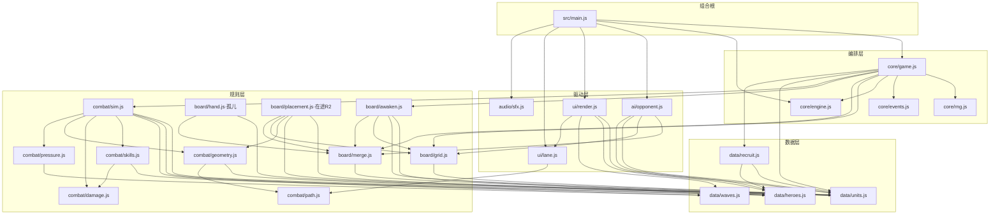

# 架构（Round 2 回签版）

> 审计基线：commit `a73875e`（代码至 `4ac3f8c`，Round 1 十路工作已全部合入父分支）。本版把 Round 1 落地的 **load/存档、暂停、增量 DOM、真实射程、压力波** 从「在途」回签为**已实现**，并重列仍缺项。
> 标记约定：**【已实现】** 与合入代码逐行核对（无标记即已实现）；**【在途·R2】** Round 2 并行 agent 工作区已有、未提交，签名可能还会变；**【缺口】** 当前代码不存在，排期见 §10 与契约 §10。
> Round 2 并行工作区（见 `/.agent_workspace/round2/DISPATCH.md`）：juice 样式（styles/*.css）、回放状态（core/game）、棋盘辅助（board/placement.js）、胜率回拉、契约测试（tests/game-contract.test.js 已入列）。

## 1. 技术栈与硬约束

- Vite 6 + 原生 ES Module，零运行时依赖，无框架、无后端、无打包别名。
- 单页挂载点 `index.html` 的 `<div id="app">`；`src/main.js` 是唯一组合根（composition root）。
- 开发/预览端口 **4180**（`strictPort: true`），`base: './'`，产物可 file:// 直开。
- 测试 Vitest（node 环境）；根 `vite.config.js` 的 `test.include` 现同时收 `tests/**/*.test.js` 与 `src/**/*.test.js`，战斗层单测已并入 `npm test`（`src/combat/vitest.config.js` 是并行开发期的独立入口遗留，其注释已过时，可跑但非必需）。
- 基准 `scripts/bench.mjs`（36 局）、冒烟 `scripts/probe.mjs`、共享不变量 `scripts/invariants.mjs`。
- 字体仍经 Google Fonts CDN 引入（`Ma Shan Zheng` / `Noto Serif SC`）——离线/内网直开会回退系统字体，见 §10 R6。

## 2. 模块图（与实际 import 逐一核对）



### 分层规则（import 白名单）

| 层 | 目录 | 允许 import | 禁止 |
| --- | --- | --- | --- |
| 数据 | `data/*` | 仅同层（`recruit→units,heroes`） | 一切上层 |
| 规则 | `board/*` `combat/*` | `data/*`、同层 | `core/game`、`ui`、`ai`、DOM |
| 编排 | `core/*` | `data/*`、规则层 | `ui`、`ai`、DOM、`window` |
| 驱动 | `ai/*` `ui/*` `audio/*` | 规则层谓词、`data/*`；`ai` 只经 `api` 动词改状态 | 直接改 `state`（残留违规：`side._acc`，§10 R4） |
| 组合根 | `main.js` | 一切 | — |

事实核查（相对 Round 1 审计的变化）：

- `core/engine.js` **不再是孤儿**：`game.js` 消费 `clampDt/createStepper/MAX_FRAME_DT`，`main.js` 消费 `clampDt/createLoop`（P12 已修）。
- `combat/path.js` 现有两个消费者：`ui/lane.js`（画路线）与 `combat/geometry.js`（射程几何），战斗逻辑经 geometry 间接使用；`nearestPathT` 本身仍无运行时调用方。
- 新孤儿：`board/hand.js` 全模块无人 import（`game.js` 直接 push/splice `side.hand`）；`board/merge.js` 的 `classifyDrop/canSwap` 只被文档与测试引用，`main.js` 的 `resolveDrop/refuseReason` 是自建判定（P10 的修复没有走 classifyDrop）。
- 模块级可变单例（同进程跨 `createGame` 实例共享、均不入存档）：`sim.BALANCE`、`geometry.REACH`、`pressure.CONFIG`、`sim.enemySeq`、`recruit.rollCounts`（WeakMap）、`opponent.boardMoveSupported`、`render.stylesInjected`。前三个有 `configureX/xConfig` 读写对，约定**只允许测试与调参脚本调用**。

## 3. 运行时状态形状【已实现】

单一可变状态树，由 `createGame()` 闭包持有；默认快照形状锁在 `tests/state.test.js`：

```ts
GameState {
  phase: "menu" | "playing" | "paused" | "over";
  winner: null | "player" | "ai";
  tie?: boolean; reason?: "hearts" | "survived" | null;  // 终局才由 sim 写入；不入默认快照（§8）
  time: number;             // 累计模拟秒
  wave: number;             // 全局波次（双侧同步），MAX_WAVE = 13
  seed: number;
  rng: Rng;                 // 序列化时剥离
  sides: { player: Side, ai: Side };
  log: LogEntry[];          // 环形 ≤200 条，{t, type, payload}
}
Side {
  id; mantou (起始60); hearts (3，漏怪钳制到 0); recruitCount;
  cells: Cell[20]; hand: Card[≤5]; enemies: Enemy[]; spawnQueue: SpawnQueueEntry[];
  kills: number; haste: number;      // 仁德攻速剩余秒
  rally?: number;                    // 仁德增伤剩余秒（首次施放才出现）
  wave: number;                      // 与全局同步，漏怪补偿/压力波取材用
  leaks?: number;                    // 漏怪计数，平局裁定用
  pressureCharge?: number;           // 压力波充能（普通兵 +1 / 将 +3）
  pressure?: { wave, received, sent };  // 压力波台账（承压方按波清零）
  _acc?: number;                     // ⚠ stepAi 节流累加器，混入序列化（§10 R4）
}
Cell  { index, col, row, unlocked, unit: Piece|null }
Enemy { id, t: 0..1, hp, maxHp, speed, reward, boss,
        skill: null|"haste"|"shield"|"split", stun, slowT, slowMul, shield,
        pressure: boolean,           // 压力援兵标记（其死亡不再充能，防对送循环）
        glyph: "兵"|"卒"|"将"|"援" }
```

棋子（`Piece`/`Card`）五种 `kind` 不变：`unit`（刀枪弓骑）、`glyph`（单字沉睡）、`hero`（觉醒武将）、`token`（神兵符，只在手牌）、`shovel`（铲子，只在手牌）。完整判别联合见 `API_CONTRACT.md` §2。

【在途·R2】回放状态工作区正在给 Side 加 `nextEnemyId` 号段、给 state 预置 `tie/reason`、`serialize({replay: true})` 写出内部字段——提交后回签。

## 4. 帧管线与增量渲染【已实现】

`main.js` 用 `engine.createLoop`（rAF、dt 已 clamp ≤0.05s）驱动，每帧严格顺序：

1. `api.tick(dt)`：内部自钳 dt 并返回推进步数；`createGame({fixedStep})` 时切 `createStepper` 固定步长（默认 1/60、单帧最多 8 步、胜负分出即提前收敛），回放/联机更稳。默认逐帧推进。
2. tick 内部固定顺序：`time += dt` → `tickSideCombat(player)` → `tickSideCombat(ai)` → `checkWinner`（先 `linkArena` 登记对手）→ 仍在 `playing` 才 `maybeAdvanceWave`（双侧敌军+出兵队列全空才推波；≥13 波转 `finishByHearts`）。
3. `stepAi(api, dt)`：0.28s 节流，每次至多一个动作（配对挪字 > 板上合并 > 手牌动作 > 征兵 > 阵型补位，按分数取最大）。
4. `drawLanes()`：每帧直画两条 canvas（DOM diff 会跳过 CANVAS，画布像素归 `drawLane` 独管）。
5. UI 重排：30Hz 节流 + 脏标记 + **状态签名**（`signature()` 拼接 phase/资源/棋面/手牌/指针态，不变则整帧跳过 DOM 工作）。

**增量 DOM（P2 已修）**：`render()` 输出到离屏 `scratch` 容器，`morphChildren` 做同构 diff 回写真实 DOM——节点身份保持不变，拖拽/悬停/选中不再被 30Hz 重建打断。三条 diff 铁律：`style` 属性由运行时注入（拖拽 ghost、touch-action），diff 不删；`CANVAS` 整棵跳过；指针态 class（`drop/selected`）由 `decorate()` 在 diff 后补挂，渲染层不管理。

输入层：PointerEvent 拖放（`DRAG_SLOP=6px` 区分点选/拖拽、ghost 跟手、`elementFromPoint` 定落点）+ 无 PointerEvent 浏览器的点选-点落兜底；键盘 空格/P 暂停、Esc 取消、Enter/E 征兵、R 重开、1–5 选牌；`visibilitychange` 自动暂停/恢复。调试入口 `window.__zhaoyun = { api, ui }`；`?seed=` URL 参数定种子。

`tickSideCombat` 单侧顺序：haste/rally 衰减 → 出兵（间隔用减法防 dt 抖动，单帧追帧上限 8 只；小兵清完 0.6s 后出 Boss）→ 行军（`t += speed*dt/520`，眩晕冻结、减速取更狠的一档）→ 逐格攻击（§5）→ 死亡结算（赏金、split 分裂 2×卒、压力充能）→ 漏怪结算（心钳 0、`leaks+1`、补偿 `8+2w` 馒头）。

## 5. 真实射程与压力波【已实现·Round 1 落地】

**真实射程（P1 已修）**：判定从「格到棋盘边缘距离」换成 **格心 ↔ 敌人当前路线坐标的真实欧氏距离**（`combat/geometry.js`，棋盘与「几」字路线同坐标系、单位为格）。`reach = range*1.2 + 0.55`，外沿 `graze = reach*1.6` 内线性衰减到 0（软边缘，摆位收益落在「罩进核心圈」而非差半格全无）。热循环用 `falloffFor(range)` 预计算 + 平方距离先筛。索敌先打核心圈内的领头者，再按 `t` 降序。一格只守它够得着的路段，弓（range 2）/黄忠（range 3）的档位真正拉开；`coverageWindows/coverageRatio/cellAnchor` 已导出供 AI/UI 用（**尚无运行时消费者**，§10 R5）。覆盖收窄导致有效输出时间约剩七成，战斗层以 `BALANCE.towerDamage = 1.35` 补偿（data 表不归战斗轮改）。

**统一伤害入口（P7 已修）**：普攻与全部大招都走 `combat/damage.applyDamage`（先破盾）；附带 `execute`（关羽斩杀线）、`applyStun/applySlow/knockback`。英雄大招冷却与是否有目标解耦（P8 已修），普攻/技能 CD 允许预支 `CD_BANK = 0.5s`，空场不再攒爆发。

**压力波（P13 压力项已修）**：一侧每积 5 点斩获充能（普通兵 1 点、将 3 点）就向对岸 `spawnQueue` 塞一波弱化援兵（血 ×0.55、速 ×1.1、赏 ×0.5、字「援」、立即放出第一只）；承压方**每波最多接 2 波**防滚雪球；压力兵之死不再充能，杜绝无限对送。对手发现走 `WeakMap`：`checkWinner/maybeAdvanceWave` 每帧幂等调用 `linkArena(state)` 登记 player↔ai（不用 `side.opponent` 字段是为了避免 serialize 循环引用；首帧击杀因链接未建不产生压力，可忽略）。手动施压入口 `sendPressure(side, otherSide)` 留给道具/剧情。

**大招 juice 契约**：`castSkill` 返回 `{id, name, fx, hits, damage, kills, targets, cooldown, juice:{shake, color, sfx, duration, focusT, shape, text, …}}`，随 `skill` 事件整包发出。**UI 尚未消费**（§10 R2）。

## 6. 事件目录【已实现】

`core/events.js` 同步总线：`on/once/onAny/off/clear`、派发时对监听列表做快照（回调内订阅/退订安全）、单监听器抛错被捕获打日志不中断循环。`game.js` 的 `emit` **先写 `state.log`（环形 200）后派发**。全部 19 种：

| type | payload | 发射点 | main.js 订阅 |
| --- | --- | --- | --- |
| `start` | `{seed}` | game.start | 清选中+清提示 |
| `reset` | `{seed}` | game.reset | — |
| `pause` / `resume` | `{}` | game.pause/resume | 常驻提示 / 清提示 |
| `load` | `{seed, phase}` | game.load | — |
| `recruit` | `{side, card, cost}` | game.recruit | sfx |
| `place` | `{side, cellIndex, unit ⚠活引用}` | game.place | — |
| `merge` | `{side, cellIndex, level}` | game.place(并入)/game.merge | sfx+toast |
| `token` | `{side, cellIndex, level}` | game.place 与 game.merge 的符分支**均发** | — |
| `move` / `swap` | `{side, from, to}` | game.merge | — |
| `expand` | `{side, cellIndex}` | game.useShovel | toast |
| `hero-awaken` | `{side, names: string[]}` | game.tryAwaken | sfx+toast |
| `skill` | `{side, hero, skill, fx, hits, damage, kills, targets, cooldown, cellIndex, juice}` | sim→castSkill 后 | sfx+toast（⚠juice 未消费） |
| `kill` | `{side, reward, boss, pressure, id}` | sim 死亡结算 | — |
| `pressure` | `{from, to, count, wave, hp}` | sim←notePressureKill | — |
| `leak` | `{side, hearts, boss}` | sim 漏怪结算 | sfx+震屏+toast |
| `wave` | `{wave}` | sim.maybeAdvanceWave | toast |
| `game-over` | `{winner, tie, reason}` | sim.checkWinner/finishByHearts | sfx+清选中 |

规则不变：**监听器只读，严禁在回调里改 state**（总线同步，回调在 tick 突变中途执行）；payload 可能持活引用（`place.unit`），`state.log` 里的 payload 在 `serialize()` 时才被深拷贝定格。

## 7. 随机与确定性

- 唯一随机源 Mulberry32（`core/rng.js`），API 齐备：`next/int/range/pick/weighted/getState/setState/reseed/clone`。**禁止 `Math.random`**（grep 为零）。
- 消费点仍仅两处：`rollRecruit`（征兵抽卡）与 `rng.pick(GLYPH_POOL)`（单字字面）。战斗、AI 决策完全无随机。
- `start()/restart()` 会 `rng.reseed(seed)` 回到序列起点：同种子重开的 rng 序列可复现。
- **已知漂移源（仍缺项）**：
  1. `sim.enemySeq` 模块级自增，跨对局/跨实例不复位，敌军 id 不可复现（§10 R3，回放工作区在途收编）。
  2. `data/recruit.js` 的课程化掉落计数器以 **rng 实例**为键存 WeakMap：`restart()` 复用同一 rng 实例，计数**不清零**；`load()` 也不恢复计数——重开或读档后「前 20 抽无工具牌」的表切换阶段会与原局漂移，破坏「同种子重开必复现」承诺（§10 R3，新发现，尚无人认领）。
  3. 玩家与 AI 共用一条 rng 流，AI 节流按真实 dt 累计，帧率差异改变双方抽卡交错；`fixedStep` 可消除帧率因素，但 per-side rng 拆分仍未做（§10 R11）。

## 8. 序列化与存档【已实现·Round 1 落地】

- `serialize(opts?: {rng?: boolean})`：显式字段白名单 `{phase, winner, time, wave, seed, sides, log}` 深拷贝（structuredClone，回落 JSON）；`{rng: true}` 附 `rngState` 游标。JSON-safe、无函数、无 rng 对象（`tests/state.test.js` 锁形状）。
- `load(snapshot): boolean`：逐侧校验回填（缺侧补空侧、hand 截到上限、cells 长度不符则弃用）、`rng.reseed(seed)` + 可选 `setState(rngState)`、stepper 复位、emit `load`。`tests/game-contract.test.js` 验证「JSON 存档 → 读档 → 随机续跑逐张一致」。
- 暂停闭环：`pause/resume/setPaused/togglePause` + `get paused`，phase 增 `"paused"`；暂停期 `tick` 返回 0 且 stepper 清积累，恢复无时间跳变；标签页隐藏自动暂停。
- **仍缺项**：`SAVE_VERSION` 未导出（Round 1 契约声明过 `SAVE_VERSION = 1`，合入时被裁，快照无版本字段）；`tie/reason` 不在白名单，读档丢终局标记（UI 现未消费，影响低）；`enemySeq` 与课程计数器不入档（§7）；`_acc` 混入 sides 快照。回放工作区【在途·R2】正在处理前两项与 enemySeq。

## 9. 隔离规则

1. 本目录 `games/zhao-yun-adou/` 是独立游戏根：不 import 仓库根或其他 `games/*`；它们也不得写入此处（`OWNERSHIP.md`）。
2. 端口独占 4180；`strictPort` 保证冲突即失败而非漂移。
3. 一切资源相对路径（`base: './'`）；唯一外部网络依赖是 Google Fonts（§10 R6）。
4. 规则层（`board/*`、`combat/*`）保持 DOM-free、window-free，node 直接单测——现状达标（render/lane/sfx 里的 document/window 均在驱动层）。
5. 模块级调参单例（§2 末）只允许测试/调参脚本写；对局内平衡改动必须走 `data/*`。
6. `node_modules`、`dist` 目录内自治；根 `test.js` 与本游戏无关，禁改。

## 10. 已知风险与仍缺项（Round 2 视角）

Round 1 审计的 P1–P14 处置结果：**已修** P1（真实射程）、P2（增量 DOM）、P7（统一伤害）、P8（CD 解耦）、P9 token 项、P10（resolveDrop 重写）、P11（token 分支双向零副作用）、P12（engine 收编）、P14（平局裁定链 心→斩获→漏怪→存粮，`tie` 如实标记）、P13 压力波项。**遗留**归入下表：

| # | 严重度 | 位置 | 问题 | 处置 |
| --- | --- | --- | --- | --- |
| R1 | 高·平衡 | 全局数值 | 合入真实射程+新数值后 headless 胜率 **91.7%**（36 局 33 胜，本轮实测），目标 45–55% | 【在途·R2】胜率回拉专线 |
| R2 | 高·演出 | `main.js`/`ui/*` | `skill.juice` 契约整包上报但 UI 只做 sfx+toast；`kill/pressure` 事件零订阅——飘字/泼墨/击杀反馈全缺 | 【在途·R2】juice 样式 + UI/AI 专线 |
| R3 | 中·确定性 | `sim.js`、`data/recruit.js` | `enemySeq` 模块级不复位；课程化抽卡计数器 restart/load 不重置/不恢复（§7） | enemySeq【在途·R2】回放专线；课程计数器**无人认领** |
| R4 | 中·分层 | `ai/opponent.js` | `side._acc` 节流器直挂状态树，混入序列化 | 【缺口】节流器移出状态树 |
| R5 | 中·AI | `ai/opponent.js` | 布阵仍按 `cellDistToPath` 内外圈老经验，未消费 `coverageWindows/coverageRatio`；`board/placement.js`【在途·R2】已按覆盖打分，但 opponent 未接入 | 【缺口】AI 接覆盖打分 |
| R6 | 中·隔离 | `index.html` | Google Fonts CDN，离线/微信内字体回退 | 【缺口】自托管 woff2 或系统字栈 |
| R7 | 低·存档 | `core/game.js` | 无 `SAVE_VERSION`；`tie/reason` 不入档 | 【在途·R2】回放专线 |
| R8 | 低·语义 | `combat/skills.js` | `castSkill` 收 `ctx.reach` 但六个 handler 全部忽略——大招按「全路线」结算已成事实设计，参数要么删要么接 | 【缺口】语义定稿 |
| R9 | 低·卫生 | `board/hand.js` 等 | 孤儿：`board/hand.js` 全模块、`classifyDrop/canSwap`、`nearestPathT`、`awaken.atkBonus`（恒 0 无消费） | 【缺口】接入或删除 |
| R10 | 低·正确性 | `core/game.js` | `place.unit` 事件 payload 持活引用；`useShovel` 不查 `canShovel` 连通性（可经 api 开孤岛格，AI 自身不会） | 【缺口】 |
| R11 | 低·确定性 | `core/game.js` | 双方共用一条 rng 流（`rng.clone()` 已具备，未拆） | 【缺口】per-side 流 |
| R12 | 低·UX | `ui/render.js` | 教程是静态面板+开局 coach 条，无强制引导、无首局记忆（未用 localStorage）；无障碍（aria/焦点管理）缺失 | 【缺口】 |
| R13 | 低·测试 | `main.js`/`ui/*` | UI 层零自动化测试（jsdom 在 devDeps 未启用）：morphChildren diff、拖拽手势、signature 跳帧均无用例 | 【缺口】 |

## 11. 性能基线（Round 2 回签时实测，node 22）

- `npm test`：9 文件 **71 用例全绿**，总时长 ~0.6s。
- `npm run probe`（seed 99）：八路径全通（recruit/place/merge/awaken/shovel/leak/gameOver/telemetry），不变量 0 违例，`passed: true`。
- `npm run bench`：36/36 收敛，玩家胜率 **0.9167**（R1 的核心待修项）；平均单局模拟 23.8ms（≈3640 tick），p95 49.2ms，max 74.9ms，阈值 2000ms 余量巨大，0 不变量违例。
- 结论：逻辑层性能依旧不是瓶颈；P2 修复后渲染层的整树重建也已消除（签名不变整帧零 DOM 工作，变更帧只 morph 差异节点）。剩余帧成本在两条 canvas 的每帧重画与 30Hz 签名字符串拼接，量级可忽略。「同屏 80+ 单位不掉 30fps」由 `MAX_ENEMIES = 120/侧` 上限与增量渲染共同兜底。

## 12. 测试与工具地图

| 入口 | 覆盖 | 用例数 |
| --- | --- | --- |
| `tests/merge.test.js` | 合并/神兵符谓词 | 3 |
| `tests/awaken.test.js` | 六武将双序觉醒、沉睡单字（`it.each`） | 7 |
| `tests/game.test.js` | 征兵费用曲线、满手/空格零副作用、铲/符、漏怪补偿、双归零裁定、落子 | 8 |
| `tests/state.test.js` | 序列化形状快照、同 seed AI 复现 | 2 |
| `tests/game-contract.test.js` | 暂停恢复不丢时间、板对板合并、报价=实扣、JSON 存档精确续跑 | 4 |
| `src/combat/geometry.test.js` | 覆盖窗口/衰减/锚点/REACH 调参 | 6 |
| `src/combat/pressure.test.js` | 施压/封顶/充能/禁用/对手发现 | 11 |
| `src/combat/sim.test.js` | 出兵/行军/索敌/衰减命中/波次/胜负链/BALANCE | 22 |
| `src/combat/skills.test.js` | 六式技能语义、护盾结算、juice 契约 | 8 |
| `scripts/probe.mjs` | 单局八路径冒烟 + 不变量（退出码即结论） | — |
| `scripts/bench.mjs` | 36 局收敛率/胜率/漏怪分布/耗时分布（内置阈值） | — |
| `scripts/invariants.mjs` | 心≤3、馒头≥0、手牌≤5、无 NaN/Infinity（probe/bench 共用） | — |

缺口：UI 层（render/lane/main 交互）零测试（§10 R13）；`board/hand.js`、`board/grid.js` 新助手无直接用例（部分被 game 路径间接覆盖）。
